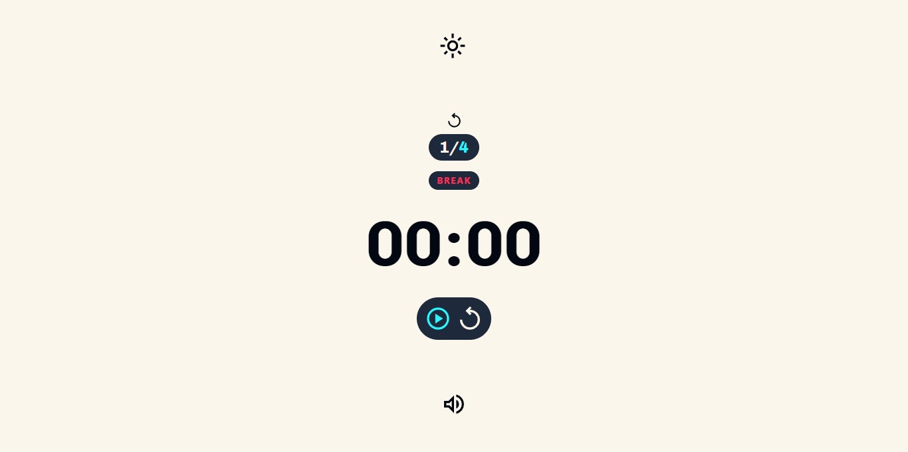

# ⏱ Minimaldoro

## 📜 Sobre o Projeto

Temporizador pomodoro com uma interface minimalista e intuitiva. O pomodoro é uma técnica de gerenciamento de tempo que consiste em dividir o trabalho em períodos, seguidos por breves intervalos intercalados.

## 💻 Temas

### Tema escuro

### Tema claro

## ✔ Funcionalidades

- ⏱ **Temporizador Pomodoro**: Defina minutos e segundos e inicie a contagem regressiva.
- 🔄 **Controle de Reprodução**: Inicie, pause e reinicie o temporizador com facilidade.
- 🔊 **Controle de Som**: Ative ou desative o som de fundo e o som de intervalo.
- 🌗 **Modo Claro e Escuro**: Alternância entre temas claro e escuro.
- 🔢 **Configuração de Rodadas**: Acompanhe o número de rodadas concluídas.

## 🛠 Tecnologias Usadas

     

## 🤝 Contribuindo

_Onde posso melhorar?_

Sinta-se à vontade para contribuir! Se você deseja colaborar com melhorias, correções ou novas funcionalidades, siga estas etapas:

1. Faça um fork do repositório.
2. Crie uma nova branch (`git checkout -b feature/nova-funcionalidade`).
3. Faça suas alterações e adicione commits (`git commit -am 'Adiciona nova funcionalidade'`).
4. Envie suas mudanças para o repositório remoto (`git push origin feature/nova-funcionalidade`).
5. Abra um Pull Request no GitHub.

---

Este projeto está licenciado sob a [MIT License](LICENSE).

---
